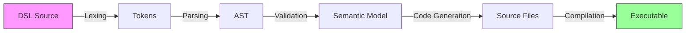
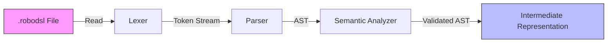
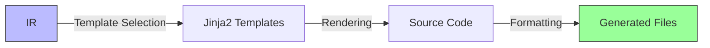
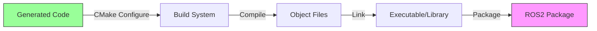
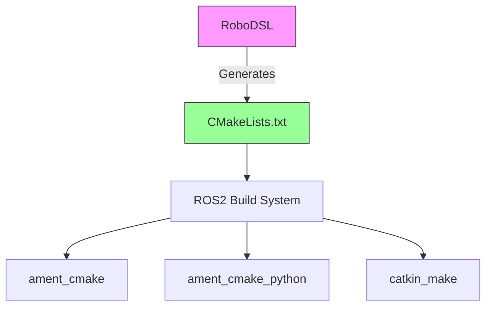

# RoboDSL Developer Guide

Welcome to the RoboDSL developer guide! This document provides comprehensive information about the project's architecture, code organization, and development workflow to help you understand and contribute effectively.

## Table of Contents
1. [Project Overview](#project-overview)
2. [Architecture](#architecture)
   - [Core Components](#core-components)
   - [Data Flow](#data-flow)
   - [Build System Integration](#build-system-integration)
3. [Module Reference](#module-reference)
   - [CLI Module](#cli-module)
   - [Parser Module](#parser-module)
   - [Generator Module](#generator-module)
   - [Template System](#template-system)
4. [Code Organization](#code-organization)
   - [Source Code Structure](#source-code-structure)
   - [Build System](#build-system)
   - [Testing Framework](#testing-framework)
5. [Development Workflow](#development-workflow)
   - [Environment Setup](#environment-setup)
   - [Building from Source](#building-from-source)
   - [Running Tests](#running-tests)
   - [Debugging](#debugging)
6. [Extending RoboDSL](#extending-robodsl)
   - [Adding New Node Types](#adding-new-node-types)
   - [Custom Code Generators](#custom-code-generators)
   - [Template Customization](#template-customization)
7. [Performance Optimization](#performance-optimization)
   - [Code Generation](#code-generation-performance)
   - [Runtime Performance](#runtime-performance)
   - [Memory Management](#memory-management)
8. [Troubleshooting](#troubleshooting)
   - [Common Issues](#common-issues)
   - [Debugging Tips](#debugging-tips)
   - [Performance Profiling](#performance-profiling)
9. [Contributing](#contributing)
   - See [Contributing](contributing.md) for detailed contribution guidelines.
   - [Pull Request Process](#pull-request-process)
   - [Code Review Guidelines](#code-review-guidelines)
   - [Release Process](#release-process)
10. [Code of Conduct](#code-of-conduct)
   - Please review our [Code of Conduct](code_of_conduct.md) before contributing.
11. [Additional Resources](#additional-resources)
    - [ROS2 Documentation](https://docs.ros.org/)
    - [CUDA Toolkit Documentation](https://docs.nvidia.com/cuda/)
    - [Python Packaging Guide](https://packaging.python.org/)

## Project Overview

RoboDSL is a domain-specific language (DSL) and compiler designed to simplify the development of GPU-accelerated robotics applications using ROS2 and CUDA. The project addresses several key challenges in robotics software development:

- **Complex Integration**: Streamlines ROS2 and CUDA integration
- **Boilerplate Reduction**: Automates repetitive code generation
- **Build System**: Handles complex CMake configurations
- **Standardization**: Enforces best practices for ROS2/CUDA development
- **Performance**: Optimized code generation for real-time systems

### Key Components

1. **DSL Parser**
   - Parses RoboDSL source files
   - Validates syntax and semantics
   - Generates an Abstract Syntax Tree (AST)

2. **Code Generator**
   - Converts AST into executable code
   - Supports C++17 and CUDA
   - Generates ROS2 nodes with lifecycle support

3. **Template System**
   - Jinja2-based template engine
   - Extensible template architecture
   - Support for custom templates

4. **Build System**
   - CMake integration
   - Cross-platform support
   - Dependency management

### Project Structure

```
robodsl/
├── src/                    # Source code
│   ├── robodsl/            # Core package
│   │   ├── cli.py          # Command-line interface
│   │   ├── parser.py       # DSL parser
│   │   ├── generator.py    # Code generator
│   │   └── templates/      # Code templates
├── examples/               # Example projects
├── tests/                  # Test suite
└── docs/                   # Documentation
```

## Architecture

RoboDSL follows a modular architecture designed for extensibility and maintainability. The system is composed of several core components that work together to provide a seamless development experience for GPU-accelerated robotics applications.

### Core Components

1. **CLI Interface** (`src/robodsl/cli.py`)
   - Built on top of Python's Click library
   - Provides a user-friendly command-line interface
   - Handles command parsing and validation
   - Manages the execution flow of code generation
   - Implements command grouping for better organization
   - Supports both interactive and non-interactive modes
   - Provides helpful error messages and usage instructions

2. **Parser Module** (`src/robodsl/parser.py`)
   - Implements the RoboDSL language parser
   - Uses a lexer/parser architecture to process input files
   - Validates syntax and semantic rules
   - Generates an Abstract Syntax Tree (AST)
   - Provides detailed error reporting with line numbers
   - Supports custom syntax extensions

3. **Generator Module** (`src/robodsl/generator.py`)
   - Converts AST into executable code
   - Manages template rendering with Jinja2
   - Handles file system operations
   - Ensures consistent code style and formatting
   - Supports multiple output formats (C++, CUDA, CMake, etc.)
   - Implements code optimization passes

4. **Template System**
   - Jinja2-based template engine
   - Template inheritance and composition
   - Custom filters and extensions
   - Support for multiple template directories

### Data Flow

RoboDSL processes your DSL code through several well-defined stages, each transforming the input into a more refined representation:



#### 1. Source Processing



- **Lexing**: Converts raw text into tokens
- **Parsing**: Builds an Abstract Syntax Tree (AST)
- **Validation**: Performs semantic checks and type inference
- **IR Generation**: Creates an optimized intermediate representation

#### 2. Code Generation



- **Template Selection**: Chooses appropriate templates based on node types
- **Rendering**: Fills templates with IR data
- **Formatting**: Applies consistent code style
- **File Writing**: Outputs to the build directory

#### 3. Build Process



- **CMake Configuration**: Sets up build rules and dependencies
- **Compilation**: Converts source to object files
- **Linking**: Combines objects into final binaries
- **Packaging**: Creates installable ROS2 packages

### Build System Integration

RoboDSL generates comprehensive CMake build files that seamlessly integrate with the ROS2 build system (ament_cmake). The build system is designed to be both powerful and flexible, supporting a wide range of build configurations.

#### Key Features



#### 1. Dependency Management

RoboDSL automatically handles dependencies through CMake's `find_package` and `ament` utilities:

```cmake
# Core Dependencies
find_package(ament_cmake REQUIRED)
find_package(rclcpp REQUIRED)
find_package(std_msgs REQUIRED)

# Conditional Dependencies
if(ENABLE_CUDA)
    enable_language(CUDA)
    find_package(CUDAToolkit REQUIRED)
    set(CMAKE_CUDA_STANDARD 17)
    set(CMAKE_CUDA_STANDARD_REQUIRED ON)
endif()

# ROS2 Components
if(ENABLE_ROS2)
    find_package(rclcpp_components REQUIRED)
    find_package(lifecycle_msgs REQUIRED)
endif()
```

#### 2. Build Configuration

RoboDSL generates optimized build configurations with support for:

- **Compiler Flags**:
  ```cmake
  add_compile_options(
      $<$<CONFIG:Debug>:-g -O0 -Wall -Wextra>
      $<$<CONFIG:Release>:-O3 -DNDEBUG>
      $<$<COMPILE_LANGUAGE:CUDA>:--expt-relaxed-constexpr>
  )
  ```

- **Target Properties**:
  ```cmake
  set_target_properties(${PROJECT_NAME} PROPERTIES
      CXX_STANDARD 17
      CXX_STANDARD_REQUIRED ON
      CUDA_ARCHITECTURES "75;80"  # Turing and Ampere
  )
  ```

#### 3. Installation Rules

RoboDSL generates proper installation rules for ROS2 packages:

```cmake
# Install executables
install(TARGETS ${NODE_TARGETS}
    RUNTIME DESTINATION lib/${PROJECT_NAME}
    LIBRARY DESTINATION lib
    ARCHIVE DESTINATION lib
)

# Install launch files
install(DIRECTORY launch/
    DESTINATION share/${PROJECT_NAME}/launch
)

# Install parameter files
install(DIRECTORY config/
    DESTINATION share/${PROJECT_NAME}/config
)

# Install Python modules
if(PYTHON_INSTALL_DIR)
    install(DIRECTORY ${CMAKE_CURRENT_SOURCE_DIR}/${PYTHON_INSTALL_DIR}/
        DESTINATION ${PYTHON_INSTALL_DIR}/
    )
endif()
```

#### 4. Testing Infrastructure

RoboDSL sets up a comprehensive testing framework:

```cmake
if(BUILD_TESTING)
    find_package(ament_lint_auto REQUIRED)
    ament_lint_auto_find_test_dependencies()

    # Add GTest
    find_package(ament_cmake_gtest REQUIRED)
    
    # Add unit tests
    ament_add_gtest(${PROJECT_NAME}_test
        test/test_basic.cpp
    )
    target_link_libraries(${PROJECT_NAME}_test
        ${PROJECT_NAME}
    )
    
    # Add performance tests if CUDA is enabled
    if(ENABLE_CUDA)
        add_executable(${PROJECT_NAME}_benchmark
            benchmark/benchmark.cu
        )
        target_link_libraries(${PROJECT_NAME}_benchmark
            benchmark::benchmark
        )
    endif()
endif()
```

#### 5. Cross-Platform Support

RoboDSL generates platform-agnostic build configurations:

```cmake
# Platform-specific settings
if(WIN32)
    add_compile_definitions(NOMINMAX)
    add_compile_options(/bigobj)
elseif(UNIX AND NOT APPLE)
    add_compile_options(-fPIC)
    if(CMAKE_CXX_COMPILER_ID MATCHES "GNU")
        add_compile_options(-march=native)
    endif()
endif()

# Handle different CUDA architectures
if(CMAKE_CUDA_COMPILER)
    set(CMAKE_CUDA_ARCHITECTURES "75;80")
    set(CMAKE_CUDA_FLAGS "${CMAKE_CUDA_FLAGS} --expt-relaxed-constexpr")
    if(CMAKE_BUILD_TYPE STREQUAL "Debug")
        set(CMAKE_CUDA_FLAGS "${CMAKE_CUDA_FLAGS} -G -O0")
    endif()
endif()
```

## Module Reference

### CLI Module (`src/robodsl/cli.py`)

#### Key Functions

```python
def init_project(project_name: str, template: str = "default") -> None:
    """Initialize a new RoboDSL project."""
    # Implementation...

def add_node(node_name: str, node_type: str = "basic") -> None:
    """Add a new node to the project."""
    # Implementation...

def generate_code(force: bool = False) -> None:
    """Generate code from RoboDSL files."""
    # Implementation...
```

### Parser Module (`src/robodsl/parser.py`)

#### Key Classes

```python
class ASTNode:
    """Base class for all AST nodes."""
    pass

class Parser:
    """Parses RoboDSL source files into an AST."""
    
    def parse(self, source: str) -> ASTNode:
        """Parse source code into an AST."""
        # Implementation...
```

### Generator Module (`src/robodsl/generator.py`)

#### Key Components

```python
class CodeGenerator:
    """Generates code from an AST using templates."""
    
    def generate(self, ast: ASTNode) -> Dict[str, str]:
        """Generate code files from AST."""
        # Implementation...

class TemplateManager:
    """Manages template loading and rendering."""
    
    def render(self, template_name: str, context: Dict) -> str:
        """Render a template with the given context."""
        # Implementation...
```

## Development Workflow

### Environment Setup

1. **Prerequisites**
   - Python 3.8+
   - ROS2 Humble or newer
   - CUDA Toolkit 11.0+
   - CMake 3.15+

2. **Installation**
   ```bash
   # Clone the repository
   git clone https://github.com/yourusername/robodsl.git
   cd robodsl
   
   # Create and activate a virtual environment
   python -m venv venv
   source venv/bin/activate  # On Windows: venv\Scripts\activate
   
   # Install development dependencies
   pip install -e ".[dev]"
   ```

### Building from Source

```bash
# Configure the build
mkdir -p build && cd build
cmake ..

# Build the project
cmake --build . --parallel $(nproc)


# Install
cmake --install .
```

### Running Tests

```bash
# Run all tests
pytest tests/


# Run a specific test file
pytest tests/test_parser.py

# Run with coverage report
pytest --cov=robodsl tests/
```

### Debugging

1. **Logging**
   ```python
   import logging
   logging.basicConfig(level=logging.DEBUG)
   ```

2. **Debugging Tests**
   ```bash
   # Run pytest with Python debugger
   pytest --pdb
   ```

## Extending RoboDSL

RoboDSL is designed with extensibility in mind, allowing developers to add new node types, custom generators, and template customizations. This section provides detailed guidance on extending the framework's capabilities.

### Adding New Node Types

1. **Create Node Templates**
   - Create a new directory in `src/robodsl/templates/nodes/`
   - Add template files following the pattern `node_type.node_type`:
     - `node_type.hpp.j2`: Header file template
     - `node_type.cpp.j2`: Implementation template
     - `node_type.launch.py.j2`: Launch file template (optional)
     - `node_type.params.yaml.j2`: Parameters template (optional)

2. **Register the Node Type**
   Update `src/robodsl/generator.py` to include your new node type:
   ```python
   NODE_TYPES = {
       'custom': {
           'description': 'Custom node type',
           'templates': {
               'header': 'nodes/custom/custom.hpp.j2',
               'source': 'nodes/custom/custom.cpp.j2',
           },
           'dependencies': ['rclcpp', 'std_msgs'],
           'cuda_support': True  # Set to True if using CUDA
       }
   }
   ```

3. **Add Validation Rules**
   Extend the parser in `src/robodsl/parser.py` to validate your node's syntax:
   ```python
   def visit_CustomNode(self, node):
       self._validate_required_fields(node, ['name', 'publisher', 'subscriber'])
       # Additional validation logic
   ```

### Custom Code Generators

For advanced use cases, you can create custom code generators:

```python
from robodsl.generator import CodeGenerator
from robodsl.ast import NodeVisitor

class CustomGenerator(CodeGenerator):
    def __init__(self, template_dir=None):
        super().__init__(template_dir)
        self.visitor = CustomNodeVisitor()
    
    def generate(self, ast, output_dir):
        # Custom generation logic
        context = self.visitor.visit(ast)
        self._render_templates(context, output_dir)

class CustomNodeVisitor(NodeVisitor):
    def visit_Node(self, node):
        # Extract node information
        return {
            'node_name': node.name,
            'dependencies': self._collect_dependencies(node)
        }
```

### Template Customization

RoboDSL uses Jinja2 for templating, providing several customization options:

1. **Template Inheritance**
   ```jinja
   {# templates/nodes/custom/custom.hpp.j2 #}
   
   
   
   class {{ node.name|to_pascal_case }} : public rclcpp::Node {
   public:
       {{ node.name|to_pascal_case }}(const rclcpp::NodeOptions& options);
       // Custom methods
   };
   
   ```

2. **Custom Filters**
   Add custom filters in `src/robodsl/generator.py`:
   ```python
   def setup_template_engine(self):
       env = Environment(loader=FileSystemLoader(self.template_dirs))
       
       # Add custom filters
       env.filters['to_snake_case'] = lambda s: s.replace(' ', '_').lower()
       env.filters['to_camel_case'] = lambda s: ''.join(
           word.capitalize() if i > 0 else word
           for i, word in enumerate(s.replace('_', ' ').split())
       )
       
       return env
   ```

3. **Template Context Processors**
   Add custom context processors to inject additional data into templates:
   ```python
   def get_template_context(self, node):
       context = super().get_template_context(node)
       context['generation_time'] = datetime.now().isoformat()
       context['ros_version'] = self._detect_ros_version()
       return context
   ```

### Plugin System

RoboDSL supports a plugin system for extending functionality:

1. **Create a Plugin**
   ```python
   # my_plugin/__init__.py
   from robodsl.plugins import Plugin
   
   class MyPlugin(Plugin):
       def register(self):
           # Register custom node types
           self.register_node_type('custom', CustomGenerator)
           
           # Add custom template directories
           self.add_template_dir('path/to/templates')
   ```

2. **Register the Plugin**
   Create a `robodsl_plugins.py` in your project root:
   ```python
   def get_plugins():
       from my_plugin import MyPlugin
       return [MyPlugin()]
   ```

3. **Enable the Plugin**
   Add to your project's configuration file:
   ```yaml
   # .robodsl/config.yaml
   plugins:
     - my_plugin
   ```

## Performance Optimization

RoboDSL provides several mechanisms to optimize both the code generation process and the generated code's runtime performance. This section covers best practices and techniques for achieving optimal performance.

### Build-Time Optimization

1. **Compiler Flags**
   - Enable link-time optimization (LTO)
   - Use profile-guided optimization (PGO)
   - Set appropriate architecture flags

   ```cmake
   # In generated CMakeLists.txt
   if(CMAKE_BUILD_TYPE STREQUAL "Release")
       add_compile_options(
           "$<$<CONFIG:RELEASE>:-O3 -march=native -flto -DNDEBUG>"
       )
       set(CMAKE_INTERPROCEDURAL_OPTIMIZATION TRUE)
   endif()
   ```

2. **Template Caching**
   - Enable template caching to avoid recompiling unchanged templates
   - Use in-memory template caching for repeated generations

   ```python
   # In generator.py
   def __init__(self):
       self.env = Environment(
           loader=FileSystemLoader(template_dirs),
           cache_size=1000,  # Cache up to 1000 templates
           auto_reload=False  # Disable auto-reload in production
       )
   ```

### Runtime Performance

1. **Zero-Copy Data Transfer**
   - Use `std::shared_ptr` for message passing
   - Leverage ROS2's intra-process communication
   - Implement move semantics where appropriate

   ```cpp
   // In generated node implementation
   void process_image(const sensor_msgs::msg::Image::SharedPtr msg) {
       // Process image without copying
       cv::Mat cv_image = cv_bridge::toCvShare(msg, "bgr8")->image;
       // ...
   }
   ```

2. **Memory Pooling**
   - Pre-allocate memory for real-time critical paths
   - Use object pools for frequently allocated/deallocated objects
   - Implement custom allocators for ROS2 messages

   ```cpp
   // Custom allocator example
   using ImageAllocator = rclcpp::message_memory_strategy::MessagePoolAllocator<sensor_msgs::msg::Image>;
   auto image_pool = std::make_shared<rclcpp::message_memory_strategy::MessagePool<sensor_msgs::msg::Image>>(10);
   ```

3. **Threading Model**
   - Configure ROS2 executor for optimal performance
   - Use callback groups to isolate real-time callbacks
   - Consider using the `rclcpp::executors::StaticSingleThreadedExecutor` for low-latency applications

   ```cpp
   // In generated node implementation
   rclcpp::executor::ExecutorArgs args;
   args.context = context;
   auto executor = std::make_shared<rclcpp::executors::StaticSingleThreadedExecutor>(args);
   executor->add_node(node);
   executor->spin();
   ```

### CUDA-Specific Optimizations

1. **Stream Management**
   - Use multiple CUDA streams for concurrent kernel execution
   - Overlap computation and data transfer
   - Implement asynchronous memory operations

   ```cpp
   // In CUDA-accelerated node
   cudaStream_t stream1, stream2;
   cudaStreamCreate(&stream1);
   cudaStreamCreate(&stream2);
   
   // Process different data in parallel
   process_kernel1<<<blocks, threads, 0, stream1>>>(d_data1);
   process_kernel2<<<blocks, threads, 0, stream2>>>(d_data2);
   ```

2. **Unified Memory**
   - Use CUDA managed memory for simplified memory management
   - Prefer `cudaMallocManaged` for data accessed by both CPU and GPU
   - Use `cudaMemPrefetchAsync` to optimize data location

   ```cpp
   float* data;
   cudaMallocManaged(&data, size * sizeof(float));
   
   // Prefetch to GPU
   cudaMemPrefetchAsync(data, size * sizeof(float), device_id, stream);
   ```

3. **Kernel Optimization**
   - Optimize block and grid dimensions
   - Use shared memory for frequently accessed data
   - Minimize thread divergence

   ```cpp
   __global__ void optimized_kernel(float* input, float* output, int width) {
       __shared__ float tile[TILE_SIZE][TILE_SIZE];
       // ...
   }
   ```

### Memory Management

1. **RAII for Resource Management**
   - Use smart pointers for automatic resource cleanup
   - Implement custom deleters for CUDA resources
   - Leverage move semantics for efficient resource transfer

   ```cpp
   struct CudaDeleter {
       void operator()(void* ptr) const { cudaFree(ptr); }
   };
   
   std::unique_ptr<float, CudaDeleter> d_data(static_cast<float*>(cuda_malloc(size)));
   ```

2. **Memory Pooling**
   - Implement custom memory pools for ROS2 messages
   - Reuse message objects when possible
   - Monitor memory usage with custom allocators

   ```cpp
   // Custom message pool
   class MessagePool {
   public:
       MessagePool(size_t initial_size) { /* ... */ }
       std::shared_ptr<sensor_msgs::msg::Image> acquire() { /* ... */ }
       void release(const std::shared_ptr<sensor_msgs::msg::Image>& msg) { /* ... */ }
   };
   ```

3. **Memory Analysis**
   - Use tools like Valgrind and AddressSanitizer
   - Monitor memory usage with ROS2's memory tools
   - Implement custom memory tracking for debugging

   ```bash
   # Run with memory checking
   valgrind --tool=massif --stacks=yes ros2 run package node
   ```

### Profiling and Optimization

1. **CPU Profiling**
   - Use `perf` for low-overhead profiling
   - Generate flame graphs for visualization
   - Profile both wall time and CPU time

   ```bash
   perf record -F 99 -g --call-graph dwarf ros2 run package node
   perf script | stackcollapse-perf.pl | flamegraph.pl > flamegraph.svg
   ```

2. **GPU Profiling**
   - Use NVIDIA Nsight Systems for timeline analysis
   - Profile CUDA kernels with `nvprof`
   - Analyze memory access patterns

   ```bash
   nsys profile --stats=true ros2 run package node
   ```

3. **ROS2-Specific Tools**
   - Use `ros2 topic hz` to monitor message rates
   - Profile with `ros2 trace` for system-wide analysis
   - Use `rqt` for runtime visualization

   ```bash
   ros2 trace --duration 10 -s tracing_session
   ```

### Best Practices

1. **Minimize Dynamic Memory Allocation**
   - Pre-allocate memory during initialization
   - Use fixed-size containers when possible
   - Avoid memory fragmentation

2. **Optimize Message Passing**
   - Use `std::unique_ptr` for exclusive ownership
   - Implement zero-copy where possible
   - Consider using ROS2's intra-process communication

3. **Profile Before Optimizing**
   - Identify actual bottlenecks before optimization
   - Measure performance impact of changes
   - Use A/B testing for optimization validation

## Troubleshooting

### Common Issues

1. **CUDA Compilation Errors**
   - Verify CUDA toolkit installation
   - Check compute capability compatibility
   - Review kernel launch parameters

2. **ROS2 Integration**
   - Source ROS2 setup files
   - Verify package dependencies
   - Check topic and service names

### Debugging Tips

1. **Verbose Output**
   ```bash
   robodsl --verbose generate
   ```

2. **Debug Symbols**
   ```bash
   cmake -DCMAKE_BUILD_TYPE=Debug ..
   ```

### Performance Profiling

1. **CPU Profiling**
   ```bash
   perf record -g ./your_node
   perf report
   ```

2. **GPU Profiling**
   ```bash
   nvprof ./your_node
   ```

## Contributing

### Pull Request Process

1. Fork the repository
2. Create a feature branch
3. Commit changes with descriptive messages
4. Push to the branch
5. Create a pull request

### Code Review Guidelines

- Follow the existing code style
- Include unit tests
- Update documentation
- Keep commits atomic

### Release Process

1. Update version in `pyproject.toml`
2. Update changelog
3. Create a release tag
4. Build and publish packages

## Additional Resources

- [ROS2 Documentation](https://docs.ros.org/)
- [CUDA Toolkit Documentation](https://docs.nvidia.com/cuda/)
- [Python Packaging Guide](https://packaging.python.org/)
- [CMake Documentation](https://cmake.org/documentation/)
- [Jinja2 Template Documentation](https://jinja.palletsprojects.com/)

## Architecture

RoboDSL follows a modular architecture designed for extensibility and maintainability. The system is composed of several core components that work together to provide a seamless development experience for GPU-accelerated robotics applications.

### Core Components

1. **CLI Interface** (`src/robodsl/cli.py`)
   - Built on top of Python's Click library
   - Provides a user-friendly command-line interface
   - Handles command parsing and validation
   - Manages the execution flow of code generation
   - Implements command grouping for better organization
   - Supports both interactive and non-interactive modes
   - Provides helpful error messages and usage instructions

2. **Parser Module** (`src/robodsl/parser.py`)
   - Implements the RoboDSL language parser
   - Uses a lexer/parser architecture to process input files
   - Validates syntax and semantic rules
   - Generates an Abstract Syntax Tree (AST)
   - Provides detailed error reporting with line numbers
   - Supports custom syntax extensions

3. **Generator Module** (`src/robodsl/generator.py`)
   - Converts AST into executable code
   - Manages template rendering with Jinja2
   - Handles file system operations
   - Ensures consistent code style and formatting
   - Supports multiple output formats (C++, CUDA, CMake, etc.)
   - Implements code optimization passes

4. **Template System** (`src/robodsl/templates/`)
   - Jinja2-based templates for code generation
   - Organized by component type and target language
   - Supports template inheritance and includes
   - Implements custom filters and extensions
   - Handles whitespace control

### Data Flow

1. **Input Processing**
   ```
   User Command → CLI → Project Setup → File Generation
   ```

2. **Node Addition**
   ```
   User Command → CLI → Parser → AST → Generator → File Creation
   ```

3. **Build Process**
   ```
   User Command → CLI → Build System Generation → Build Execution
   ```

## Module Reference

### CLI Module (`cli.py`)

The CLI module provides the command-line interface for RoboDSL, handling user interactions and orchestrating the code generation process.

#### Key Functions

1. **`init(project_name, template, output_dir)`**
   - Creates a new RoboDSL project
   - Sets up the directory structure
   - Initializes configuration files

2. **`add_node(node_name, publisher, subscriber, language, project_dir)`**
   - Adds a new node to an existing project
   - Handles file generation for the specified language
   - Updates build configurations

3. **`build(project_dir)`**
   - Generates build files
   - Executes the build process
   - Handles build artifacts

### Parser Module (`parser.py`)

The parser module processes the RoboDSL syntax and generates an abstract syntax tree (AST).

#### Key Components

1. **Lexer**
   - Tokenizes input files
   - Handles syntax highlighting
   - Reports lexical errors

2. **Parser**
   - Validates syntax
   - Builds AST
   - Enforces semantic rules

3. **AST**
   - Represents the program structure
   - Enables code generation
   - Supports transformations

### Generator Module (`generator.py`)

The generator module transforms the AST into target code.

#### Key Features

1. **Template Rendering**
   - Uses Jinja2 for templating
   - Supports multiple output formats
   - Handles indentation and formatting

2. **File Management**
   - Creates directories as needed
   - Handles file overwrites
   - Manages file permissions

3. **Code Generation**
   - C++ node generation
   - Python node generation
   - Build system files
   - Launch configurations

## Code Organization

### Source Code (`src/robodsl/`)

- **`__init__.py`**: Package initialization and version information
- **`cli.py`**: Command-line interface implementation using Click
- **`parser.py`**: DSL parsing and validation logic
- **`generator.py`**: Code generation logic and template handling

### Test Structure (`tests/`)

- **`test_cli.py`**: Tests for command-line interface
- **`test_parser.py`**: Tests for DSL parsing and validation
- **`test_add_node.py`**: Tests for node generation
- **`test_subnodes.py`**: Tests for nested node functionality
- **`fixtures/`**: Test fixtures and helper functions

### Templates (`templates/`)
- **`cpp/`**: C++ node templates
- **`python/`**: Python node templates
- **`launch/`**: ROS2 launch file templates
- **`cmake/`**: CMake configuration templates

### Generated Project Structure

```
my_project/
├── src/                    # Node source files
│   ├── my_node.cpp         # C++ node implementation
│   └── my_node.py          # Python node implementation
│
├── include/               # C++ headers
│   └── my_node/
│       └── my_node.hpp   # Node header
│
├── launch/                # Launch files
│   └── my_node.launch.py
│
├── config/                # Configuration files
│   └── my_node.yaml
│
├── robodsl/               # DSL definitions
│   └── nodes/
│       └── my_node.robodsl
│
├── CMakeLists.txt         # Build configuration
└── package.xml            # ROS2 package definition
```

### Test Structure (`tests/`)

- `test_cli.py`: CLI command tests
- `test_parser.py`: DSL parsing tests
- `test_add_node.py`: Node generation tests
- `test_subnodes.py`: Nested node tests
- `fixtures/`: Test fixtures and utilities

## File-by-File Breakdown

### Root Directory

- **`LICENSE`**: The MIT License file for the project.
- **`PLAN.md`**: The development plan for the project.
- **`README.md`**: The main README file with a project overview, features, and usage instructions.
- **`DEVELOPER_GUIDE.md`**: This file, providing detailed information for developers.
- **`pytest.ini`**: Configuration file for pytest, specifying the test directory.
- **`setup.py`**: The setup script for the project, used for packaging and distribution.

### `config/` Directory

- **`*.yaml`**: Sample YAML configuration files for nodes. These files are used to define node parameters and settings.

### `include/` Directory

- **`*/*_node.h`**: C++ header files for nodes. These files contain the class definitions for the nodes.

### `launch/` Directory

- **`*.launch.py`**: ROS2 launch files for nodes. These files are used to launch the nodes and configure their settings.

### `src/` Directory

- **`robodsl/`**: The main package for the RoboDSL tool.
  - **`__init__.py`**: Initializes the `robodsl` package.
  - **`cli.py`**: The heart of the RoboDSL tool, defining the command-line interface (CLI) using `click`. It handles commands like `init`, `build`, and `add-node`, and orchestrates the creation of node files, launch files, and configuration files.
  - **`parser.py`**: Contains the parsing logic for the RoboDSL language. It is responsible for reading `.robodsl` files and extracting the node definitions, publishers, subscribers, and other information.
- **`robodsl.egg-info/`**: Contains metadata for the `robodsl` package.
- **`*_node.cpp` / `*_node.py`**: Generated source files for nodes. These files contain the main logic for the nodes.

### `tests/` Directory

- **`test_add_node.py`**: Tests for the `add-node` command, ensuring that nodes are created correctly.
- **`test_cli.py`**: General tests for the CLI, covering basic commands and error handling.
- **`test_parser.py`**: Tests for the RoboDSL parser, ensuring that `.robodsl` files are parsed correctly.
- **`test_subnodes.py`**: Tests for the subnode functionality, ensuring that nested nodes are created and configured correctly.

## Core Components

### 1. Command-Line Interface (`cli.py`)

The CLI is the main entry point for RoboDSL, built using the `click` library.

#### Key Commands

```bash
# Initialize a new project
robodsl init my_project

# Add a new node
robodsl add-node my_node --language cpp

# Build the project
robodsl build
```

#### Key Functions

- `init()`: Creates a new project structure
- `add_node()`: Adds a new node to the project
- `build()`: Builds the project
- `_create_node_files()`: Handles file generation
- `_get_node_file_paths()`: Manages file paths

### 2. DSL Parser (`parser.py`)

Parses `.robodsl` files and validates the syntax.

#### Key Features
- Supports node definitions with publishers, subscribers, and parameters
- Validates message types and parameter values
- Generates an abstract syntax tree (AST)

#### Example DSL
```rubynode my_node {
    publisher /output std_msgs/msg/String "Hello"
    subscriber /input std_msgs/msg/String
    parameter rate 10
}
```

### 3. Code Generation

#### C++ Generation
- Creates `.hpp` and `.cpp` files
- Handles class definitions and implementations
- Manages include guards and namespaces

#### Python Generation
- Generates executable Python nodes
- Handles imports and class definitions
- Sets up ROS2 node lifecycle

### 4. Build System
- Generates `CMakeLists.txt`
- Handles dependencies
- Configures CUDA compilation (coming soon)

## Development Workflow

### Setting Up for Development

1. **Clone the repository**
   ```bash
   git clone https://github.com/yourusername/robodsl.git
   cd robodsl
   ```

2. **Set up a virtual environment**
   ```bash
   python3 -m venv venv
   source venv/bin/activate  # On Windows: venv\Scripts\activate
   ```

3. **Install development dependencies**
   ```bash
   pip install -e ".[dev]"
   ```

### Running Tests

```bash
# Run all tests
pytest tests/

# Run a specific test file
pytest tests/test_add_node.py -v

# Run with coverage
pytest --cov=robodsl tests/
```

### Code Style

We use:
- **Black** for code formatting
- **Flake8** for linting
- **Mypy** for type checking

```bash
# Format code
black .

# Check style
flake8
# Check types
mypy .
```

## Contributing

We welcome contributions! Here's how to get started:

1. **Find an issue** or create a new one
2. **Fork** the repository
3. Create a feature branch: `git checkout -b feature/amazing-feature`
4. Commit your changes: `git commit -m 'Add amazing feature'`
5. Push to the branch: `git push origin feature/amazing-feature`
6. Open a **Pull Request**

### Pull Request Guidelines

- Include tests for new features
- Update documentation
- Follow the existing code style
- Keep PRs focused and small

## Additional Resources

- [ROS2 Documentation](https://docs.ros.org/)
- [CUDA Toolkit Documentation](https://docs.nvidia.com/cuda/)
- [Click Documentation](https://click.palletsprojects.com/)
- [Pytest Documentation](https://docs.pytest.org/)

## Acknowledgments

- The ROS2 and CUDA communities
- All contributors who have helped improve RoboDSL
- The Python ecosystem for amazing developer tools
